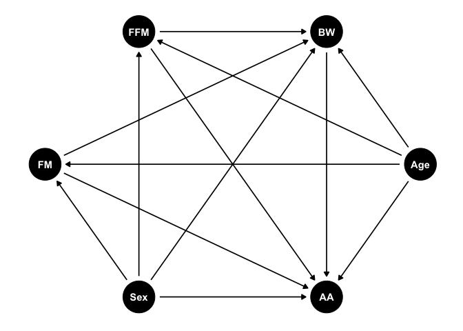

Short protocol for exploratory amino acid and fat mass analyses
================
Thomas Olsen (PhD), Ane S. Kværner (PhD), Vegard Lysne (PhD), Kathrine
J. Vinknes (PhD)

### Aim of the study

The aim of the present project is to explore the relationship between
clinical markers of body composition derived from bioelectrical
impedance analysis (BIA) and dual X-ray absorptiometry (DXA) and amino
acid profile in plasma and urine. Protein intake and plasma
concentrations of amino acids are becoming increasingly recognized in
metabolic disease. Branched chain amino acids (BCAAs) have recently been
considered causal in the development of type 2 diabetes, and the
literature on the associations of aromatic amino acids and sulfur amino
acids with obesity is extensively documented in animal and observational
studies. Less literature is available on the relationship between amino
acids and body fat distribution and novel, clinically relevant markers
of body composition. In this cross-sectional study we will use data from
normal weight and overweight subjects to assess the relationship between
distribution of fat mass derived from DXA and BIA including visceral
adipose tissue (VAT), subcutaneous adipose tissue (SAT) and appendicular
adipose tissue with plasma and urine concentrations of amino acids. In
addition, we will use raw impedance data in the clinical assessments of
body composition including resistance, reactance and phase angle data
from the bioimpedance measurements and assess their relationship with
the amino acid profile in blood and urine.

### Study population

Data were obtained from 34 men and women who participated in two pilot
dietary interventions published
[here](https://www.mdpi.com/2072-6643/10/12/1822) and
[here](https://translational-medicine.biomedcentral.com/articles/10.1186/s12967-020-02288-x).
Both trials were registered on www.ClinicalTrials.gov (NCT02647970 and
NCT03629392).

#### Initial analyses

All statistical analyses in this study will be conducted by using R
software for statistical computing. Distribution of continuous variables
will be assessed visually, preferably by using the `skimr::skim()`
function, but depend on the methods used for outcome analysis. E.g. for
regression analyses, normal distribution will be checked for model
residuals and transformations applied as appropriate. Measures of
central tendency and dispersion will be presented in a <b>Table 1</b>
for relevant variables and the full amino acid profile for the total
population.

#### Main outcome analyses

Associations between amino acids and measures of body composition will
be performed using linear regression. Data will be transformed as
appropriate depending on the distribution of residuals in preliminary
models using the raw data. A directed acyclic graphs (DAG) presented in
Figure 1 outlines the rationale for covariate adjustment. Figure 2
illustrates valid adjustment sets. Main outcomes will be presented as
scatterplots with the line of best fit. Uncertainty will be visualized
by constructing hypothetical outcome plots using the `ungeviz()` package
and the `bootstrappify()` function to generate bootstrapped analyses in
order to visualize uncertainty. Estimates from the linear regression
models, confidence interval and p-values will be presented in the online
supplementary material.

``` r
dag<-dagitty::dagitty("dag{FM -> AA
FFM -> AA
Age -> AA
Age -> FFM
Sex -> FM
Sex -> FFM
FM -> BW
FFM -> BW
Sex -> BW
BW -> AA
Sex -> AA
Age -> FM
Age -> BW
FM [exposure]
AA [outcome]}")

tidy_dag<-ggdag::tidy_dagitty(dag)

ggdag::ggdag(dag, layout="circle") +
  ggthemes::theme_tufte() +
  theme(axis.text = element_blank(),
        axis.title = element_blank(),
        axis.ticks = element_blank())
```

<!-- -->

<b>Figure 1:</b> <i>Directed acyclic graph illustrating relevant
associations between the exposure- and outcome variable and potential
confounding factors. Abbreviations: AA, amino acid; BW, body weight;
FFM, fat free mass; FM, fat mass.</i>

Based on the DAG above, minimal adjustment sets were created. Models
will be adjusted for age, sex and fat free mass. Note that fat mass is a
proxy for body fat distribution.

``` r
ggdag_adjustment_set(tidy_dag, type="all", effect="total") +
  theme_dag_grey() +
  theme(legend.title=element_blank())
```

<!-- -->

<b>Figure 2</b>: <i>Valid minimal adjustment sets based on the directed
acyclic graph. Abbreviations: AA, amino acid; BW, body weight; FFM, fat
free mass; FM, fat mass.</i>

#### Exploratory multivariable analyses

We will perform data-driven principal component analysis (PCA) to derive
potential clusters of amino acids that are highly correlated and in turn
whether these clusters are associated with measures of body composition.
Principal components of interest will be determined by visual inspection
of a scree plot and with an eigenvalue of \> 1. Correlation plots for
the individual amino acids contributing to each factor will be
constructed. Labeling of components (e.g. sulfur containing amino acids)
relies on prior knowledge and the quantitative contribution (factor
loadings) of each amino acid to the principal component. Varimax
rotation will be applied to the coordinate system. Rotation to maximize
variance explained depend on the assumed intercorrelation between
factors. Correlations between individual amino acids in blood depend on
their properties, but it is reasonable to assume that some correlation
exist between the different sub-classes of amino acids, especially
considering that most are responsive to food intake. Thus, oblique
rotation of the coordinate system, which is appropriate in scenarios
where some correlation between principal components are expected, will
be applied.

### Presentation of results

Whenever possible, results will be presented visually using the
`ggplot2()` package. Scatter plots with the linear regression line
superimposed. Hypothetical outcome plots, based on 50 bootstrapped
samples, are included to visualize the uncertainty around the estimates.
An example is shown below. In the online supplement we will include plot
of the real data and 19 null plots to illustrate expected variation
under conditions with no association.

``` r
x <- rnorm(100, 10, 1.5)
Zx <- scale(x)
Zy <- .5*Zx + rnorm(100, 0, sqrt(1 - (.8^2)))
df <- data.frame(Zx, Zy)
 
a<-ggplot(df, aes(Zx, Zy)) +
  geom_smooth(data=bootstrapper(50), aes(group=.draw), color="grey", se=F, method="lm") +
  geom_smooth(method="lm", se=F, size=3) +
  geom_point() 

b<-ggplot(df, aes(Zx, Zy)) +
  geom_smooth(data=bootstrapper(50), aes(group=.draw), color="grey", se=F, method="lm") +
  geom_smooth(method="loess", se=F, size=3) +
  geom_point() 

a+b
```

<!-- -->

<b>Figure 3</b>: <i>Example of an hypothetical outcome plot with 50
bootstrapped samples of simulated data. Blue line indicates original
line of best fit, grey lines are derived from 50 bootstrapped samples.
Panels show linear and loess fit</i>

#### Statistical software

All statistical analyses will be performed using the most recent R
version. Data cleaning and organization will be performed using packages
available in the `tidyverse()` collection of packages. All code and
affiliated data will be made available on GitHub upon publication of the
manuscript.
